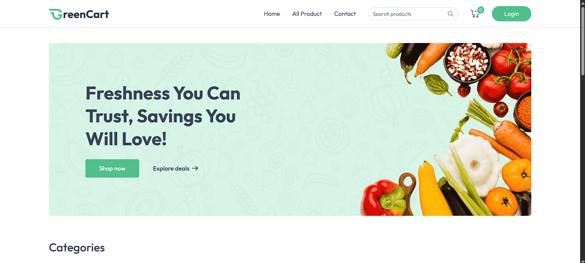
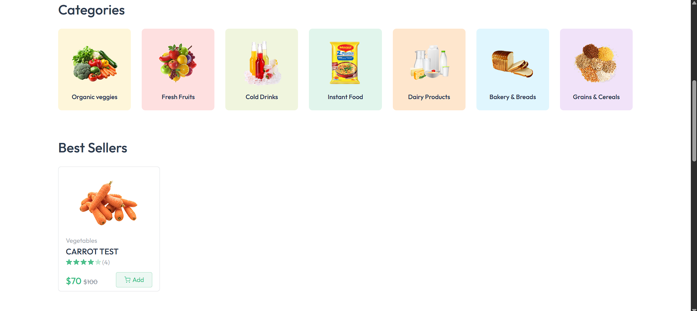
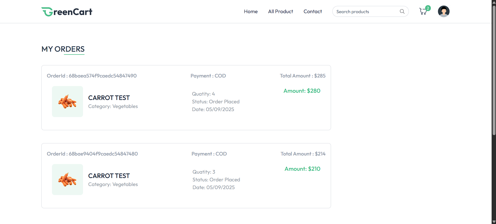
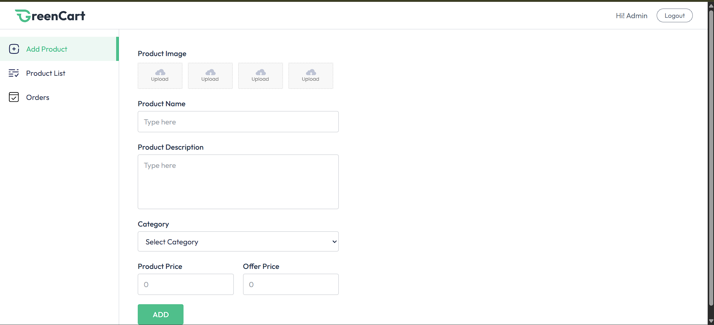
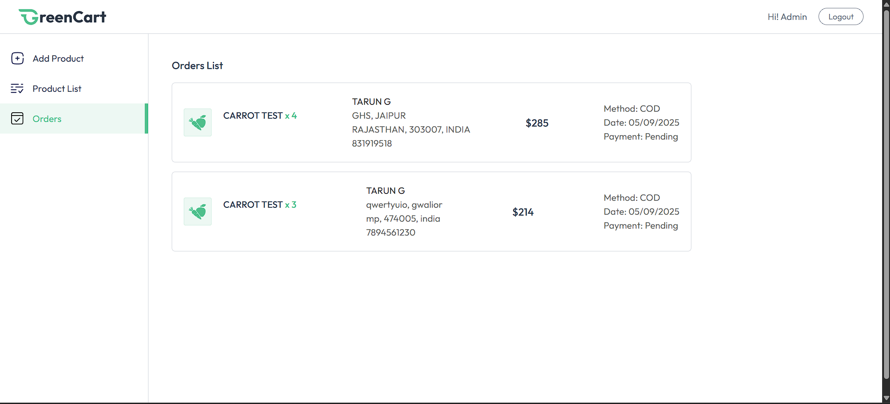

# 🛒 GreenCart Frontend

A modern **React-based frontend** for the GreenCart e-commerce platform, built with **Vite** and **Tailwind CSS**.

---

## 🚀 Features

### 👨‍💻 User Interface

* **Responsive Design** – Mobile-first approach with Tailwind CSS
* **Modern UI Components** – Clean and intuitive design
* **Product Catalog** – Browse products by categories
* **Shopping Cart** – Persistent cart with real-time updates
* **User Authentication** – Login/Register with JWT
* **Order Management** – Track orders and order history
* **Address Management** – Multiple shipping addresses

### 🛒 Seller Interface

* **Seller Dashboard** – Dedicated seller portal
* **Product Management** – Add, edit, and manage products
* **Order Processing** – View and manage customer orders
* **Image Upload** – Drag-and-drop image upload with preview

### ⚙️ Technical Features

* **React 19** – Latest React features
* **React Router DOM** – Client-side routing
* **Context API** – Global state management
* **Axios** – HTTP client with interceptors
* **React Hot Toast** – Beautiful notifications
* **Vite** – Fast build tool and dev server

---

## 📂 Project Structure

```
client/
├── public/
│   ├── favicon.svg
│   └── vite.svg
├── src/
│   ├── assets/              # Images and static assets
│   │   ├── .png             # Product images
│   │   ├── .svg             # Icons and logos
│   │   └── assets.js        # Asset imports
│   ├── components/          # Reusable UI components
│   │   ├── NavBar.jsx       # Navigation component
│   │   ├── Footer.jsx       # Footer component
│   │   ├── ProductCard.jsx  # Product display card
│   │   ├── Login.jsx        # User login modal
│   │   └── seller/          # Seller-specific components
│   ├── context/             # React Context
│   │   └── AppContext.jsx   # Global state management
│   ├── pages/               # Route components
│   │   ├── Home.jsx         # Homepage
│   │   ├── AllProducts.jsx  # Product listing
│   │   ├── ProductDetails.jsx # Product details
│   │   ├── Cart.jsx         # Shopping cart
│   │   ├── MyOrders.jsx     # Order history
│   │   └── seller/          # Seller pages
│   ├── App.jsx              # Main app component
│   ├── main.jsx             # App entry point
│   └── index.css            # Global styles
├── package.json
├── vite.config.js
└── vercel.json
```

---

## 🛠️ Technology Stack

* **React 19.1.0** – UI library
* **React Router DOM 7.7.1** – Routing
* **Tailwind CSS 4.1.11** – Styling
* **Axios 1.11.0** – HTTP client
* **React Hot Toast 2.5.2** – Notifications
* **Vite 7.0.4** – Build tool

---

## ⚡ Getting Started

### ✅ Prerequisites

* Node.js (v16 or higher)
* npm or yarn

### 📥 Installation

1. **Navigate to client directory**

   ```bash
   cd client
   ```

2. **Install dependencies**

   ```bash
   npm install
   ```

3. **Environment Setup**
   Create `.env` file in client directory:

   ```env
   VITE_BACKGROUND_URL=http://localhost:4000
   VITE_CURRENCY=₹
   ```

4. **Start development server**

   ```bash
   npm run dev
   ```

5. **Open browser**
   Navigate to 👉 `http://localhost:5173`

---

## 📱 Available Scripts

* `npm run dev` – Start development server
* `npm run build` – Build for production
* `npm run preview` – Preview production build
* `npm run lint` – Run ESLint

---

## 🎨 UI Components

### Core Components

* **NavBar** – Navigation with cart and user menu
* **Footer** – Footer with site links
* **ProductCard** – Product display component
* **Login** – Authentication modal
* **Loading** – Loading spinner component

### Page Components

* **Home** – Landing page with banners and categories
* **AllProducts** – Product listing with filters
* **ProductDetails** – Detailed product view
* **Cart** – Shopping cart management
* **MyOrders** – Order history and tracking

### Seller Components

* **SellerLayout** – Seller dashboard layout
* **AddProduct** – Product creation form
* **ProductList** – Seller's product management
* **Orders** – Order processing interface

---

## 🖼️ Screenshots

### 🏠 Home Page



### 📦 Category Page



### 🛒 Cart Page


### 📑 My Orders Page



### 🛍️ Seller Dashboard



### 📬 Seller Orders Received




---

## 🎯 Key Features Implementation

### Authentication Flow

1. User clicks login/register
2. Modal opens with form
3. API call to backend
4. JWT token stored in HTTP-only cookie
5. User state updated in context
6. Protected routes accessible

### Shopping Cart

1. Add to cart updates context
2. Cart persisted in user's database record
3. Real-time cart updates
4. Persistent across sessions

### Product Management (Seller)

1. Image upload to Cloudinary
2. Form validation
3. API integration for CRUD operations
4. Real-time inventory updates

---

## 🎨 Styling

* **Tailwind CSS** – Utility-first CSS framework
* **Responsive Design** – Mobile-first approach
* **Custom Components** – Reusable styled components
* **Dark/Light Mode** – Planned future feature

---

## 📱 Responsive Breakpoints

* **Mobile**: < 640px
* **Tablet**: 640px – 1024px
* **Desktop**: > 1024px

---

## ⚙️ Configuration

### Vite Config

```javascript
// vite.config.js
export default defineConfig({
  plugins: [react()],
  server: {
    port: 5173,
    proxy: {
      '/api': 'http://localhost:4000'
    }
  }
})
```

### Tailwind Config

```javascript
// tailwind.config.js
export default {
  content: ['./index.html', './src/**/*.{js,ts,jsx,tsx}'],
  theme: {
    extend: {
      colors: {
        primary: '#your-primary-color',
        secondary: '#your-secondary-color'
      }
    }
  }
}
```

---

## 🚀 Deployment

### Vercel Deployment

1. Connect GitHub repository
2. Set build command: `npm run build`
3. Set output directory: `dist`
4. Add environment variables
5. Deploy

### Environment Variables

```env
VITE_BACKGROUND_URL=https://your-api-domain.com
VITE_CURRENCY=₹
```

---

## 🧪 Testing

```bash
# Run tests (when implemented)
npm test

# Run tests with coverage
npm run test:coverage
```

---

## 📦 Build Output

The build process creates:

* `dist/` – Production build
* Optimized assets
* Code splitting
* Tree shaking

---

## 🤝 Contributing

1. Follow React best practices
2. Use functional components with hooks
3. Implement proper error handling
4. Add loading states
5. Ensure responsive design
6. Write clean, readable code

---

## 📝 License

This project is licensed under the **MIT License**.
